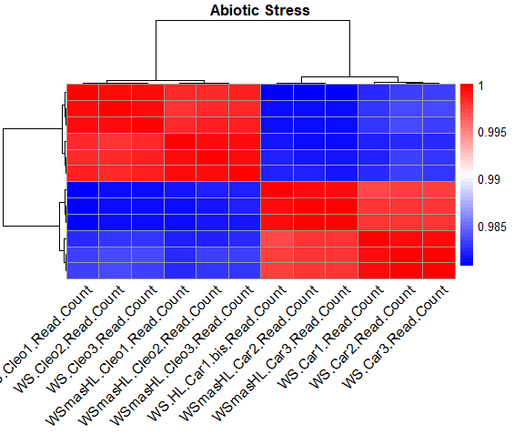
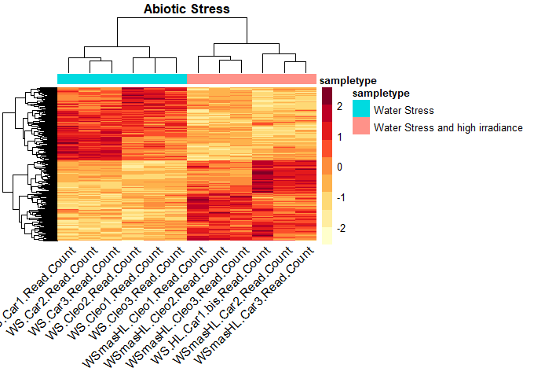
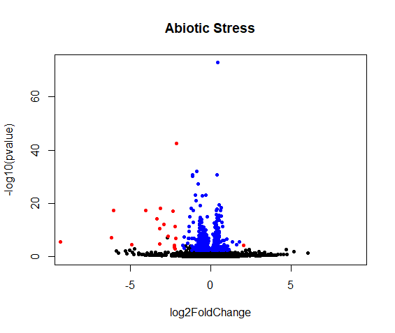

# Differential-Genes-in-Two-Types-of-Abiotic-Stress-in-Plants

## Introduction
Differential expression analysis is a technique used to identify genes that are expressed differently between two or more biological samples. This analysis is commonly used in transcriptomics studies, where the amount of messenger RNA (mRNA) produced by a gene under different experimental conditions is measured. Differential expression analysis allows us to identify genes that are regulated in response to a specific treatment or condition, which can help us understand the molecular mechanisms underlying a particular phenotype. Common methods for differential expression analysis include fold change, t-test, and analysis of variance (ANOVA) 1.

In differential expression analysis, gene expression levels are compared between two or more groups of biological samples. The goal is to identify genes that are expressed differently between groups and determine whether these differences are statistically significant. Fold change is a common measure used to quantify the magnitude of change in gene expression between two groups. The t-test and ANOVA are statistical methods used to determine whether the observed differences in gene expression are significant

## About the article
The analysis carried out by Santa‐Catarina, & Gómez‐Cadenas, A. (2022), aimed to study the effect of abiotic stress combinations on the photosynthetic apparatus of two citrus genotypes, Carrizo citrange and Cleopatra mandarina. Their study showed that the plants were able to increase the expression of genes and proteins related to photosystem repair.

## About the data
The count data and metadata were taken from: Damián Balfagón, Zandalinas, S. I., dos, T., Claudete Santa‐Catarina, & Gómez‐Cadenas, A. (2022). Reduction of heat stress pressure and activation of photosystem II repairing system are crucial for citrus tolerance to multiple abiotic stress combinations. Physiologia Plantarum, 174(6). https://doi.org/10.1111/ppl.13809 and from the Gene Expression Omnibus Data (https://www.ncbi.nlm.nih.gov/geo/query/acc.cgi?acc=GSE203331) The data contains 48 samples with 6 biological replicates for each stress condition. You can find the GDC data here (https://www.ncbi.nlm.nih.gov/geo/query/acc.cgi?acc=GSE203331)

## About the analysis 
In this analysis, we took only the samples belonging to the conditions of water stress (WS) and water stress together with irradiation (WS + HL), belonging to the project mentioned above. 

We found differential genes and contrasted the analysis in both conditions to observe metabolites and functions that are overexpressed or inactivated for each condition.
Differential expression analysis allows us to obtain genes that are deactivated/overexpressed for each condition. So if you contrast WS against WS+ HL with Deseq2, you would expect to see genes that are overexpressed for WS and inactive for WS+HL (this will depend on the bioinformatics software you decide to use). 

## Methods
We use R's Deseq2 library to generate the condition contrast. In this repository, we are going to show the necessary steps of differential expression analysis. To do this, we are going to divide it into different steps.

1)	Obtaining metadata and counts
   
2)	Entrance to Deseq2
  
3)	Gene Expression Analysis
   
4)	Differential Expression Analysis
   
5)	Analysis of results

   
### Step 1
The metadata and input counts for Deseq2 should be in a default way. Both need to keep the same name as the samples. At the same time, the metadata must contain the name of both conditions.  As shown below:

 ``` R
#librerias
library(dplyr)
library(DESeq2)
library(data.table)
library(tidyr)
library(gridExtra)
library(tidyverse)
library(tidyr)

#################################################################
##### METADATA ########################
######################################################3
# Perform the table with metadata and conditions, for deseq2, is 
#It is necessary to have a column with the samples and another with the condition

sampledata <- data.frame(
  samples=c("WS. Car1_Read_Count", "WS. Car2_Read_Count",       
            "WS. Car3_Read_Count", "WS. Cleo1_Read_Count" ,      
            "WS. Cleo2_Read_Count", "WS. Cleo3_Read_Count",
            "WS. HL. Car1.bis_Read_Count",
            "WSmasHL.Car2_Read_Count", 
            "WSmasHL.Car3_Read_Count", 
            "WSmasHL.Cleo1_Read_Count", 
            "WSmasHL.Cleo2_Read_Count",
            "WSmasHL.Cleo3_Read_Count"
            ),
  
  Condition=c( "Water Stress", "Water Stress", "Water Stress","Water Stress",
               "Water Stress","Water Stress", "Water Stress and high irradiance",
               "Water Stress and high irradiance","Water Stress and high irradiance",
               "Water Stress and high irradiance","Water Stress and high irradiance",
               "Water Stress and high irradiance")
  
)
 ``` 


Now, we load the counts to R and make sure to select the samples that we're going to use for our analysis. 


 ``` R
#################################################################
##### COUNTS ########################
######################################################

data <- read.table("counts.txt", header=TRUE, sep="\t")

#Delete columns we will not use
colnames(data)

data <- filter( data, Type=="protein_coding")
#12 658 Coding Genes


data <- select(data, -Feature_GID, -Feature_TID, -Type, -Gene_Symbol,
               -Gene_Synonym, -Protein_ID, -Product)

data <- data[, 1:49]

counts <- data %>% 
         gather(key = 'samples', value = 'counts', -Entrez_Gene_ID) %>% 
          merge(sampledata, by="samples") %>%
             select(1,2,3) %>%
          mutate(samples = gsub('\\_', '.', samples)) 
  
counts <- counts %>%
         spread(key = 'samples', value = 'counts') 
         
counts <- na.omit(counts)
counts <- counts %>%
        column_to_rownames(var="Entrez_Gene_ID")

#apply changes
sampledata <- sampledata %>%
  mutate(samples = gsub('\\_', '.', samples)) 

save(sampledata, counts, file="Entrada_Deseq2.RData")
 ``` 

We have modified our data to be able to generate the data matrix for Deseq2. 

### Step 2

Next, with the data and metadata generated, we create the data matrix for Deseq2, followed by low-count filtering and variance stabilization. The latter will allow us to evaluate the gene expression of our samples and observe samples outside the range of the analysis. Samples that are very distant from each other (if any) should be removed so as not to affect the analysis.  
Sometimes it is necessary to look at the distribution of your counts in order to assess where to assign the pre-filtering of genes. 


 ``` R
############################################################################
##### DESEQ2 ENTRY ###########################
###################################################
load("Entrada_Deseq2.RData")
# Making the row names and column names identical
all(rownames(counts) %in% colnames(sampledata))
all(rownames(counts) == colnames(sampledata))


# Create dds
dds <- DESeqDataSetFromMatrix(countData = counts,
                              colData = sampledata,
                              design = ~ Condition) 

#Delete 0 counts
dds10 <- dds[rowSums(counts(dds)) >= 10]
nrow(dds10) #10,613 genes

##########################################################################
##### b) Stabilization #########
dds_wt <- estimateSizeFactors(dds10)

##########################################################################
###### c) Factors Stabilization #########

rld<-rlog(dds_wt, blind = TRUE)
head(assay(rld))
 ``` 

### Step Three
Let's look at the effect of stabilization on our samples. Some prefer to take the assessment through PCA. Or any other method.  Here we show three different ways to assess gene expression. 


 ``` R
##################################################################
###### Heatmap  #######

rld_mat_wt <- Assay(RLD)
vsd_cor_wt <- cor(rld_mat_wt)

#save matrix
write.table(vsd_cor_wt, file="rld_cor_abiotic.tsv", sep="\\t", row.names=TRUE, col.names=TRUE)

# Heatmap
library(pheatmap)
# Data Preparation
data_for_heatmap <- as.matrix(vsd_cor_wt)

# Convert tissue-type to a character vector
annotation_row <- as.character(sampledata$Condition)

# Add space between words  
annotation_row_with_spaces <- paste(" ", annotation_row, " ")

# Heatmap 
pheatmap(data_for_heatmap,
         cluster_rows = TRUE,
         cluster_cols = TRUE,
         main="Abiotic Stress",
         color = colorRampPalette(c("blue", "white", "red"))(50),
         show_rownames = FALSE,
         show_colnames = TRUE,
         row_names_side = "left",
         annotation_colors = "black",
         annotation_names_row = FALSE,
         labels_row = annotation_row_with_spaces,
         fontsize_row = 8,     
         fontsize_col = 12,    
         angle_col = "45")      

##################################################################
####### PCA and boxplot ###########################################
#Boxplot
boxplot(counts, outline=FALSE, main="Before stabilization", xaxt="n")
boxplot(rld_mat_wt, outline=FALSE, main="After stabilization", xaxt="n")

#PCA
plotPCA(rld, intgroup = "Condition")

save(dds,dds10, dds_wt, rld, file="rlds_Abiotic_Stress.RData")
 ``` 
We should not observe outlier samples. Here we do not have outliers then we can continue



### Step Four

It's time to perform the differential expression analysis.  To do this, it is necessary to set our conditions to R. 

 ``` R


#Reorder res from lowest to highest
res<-res[order(res$padj),]

res_table<- as.data.frame(res)

resig_table<- as.data.frame(resSig)

#save beef
write.csv( as.data.frame(res), file="resultsDEG_AbioticStress.csv" )

#save regulates genes
write.csv( as.data.frame(resSig), file="Down_Up_AbioticStress.csv" )

save(res, dds,resSig, file="DEG_AbioticStress.RData")

sum( res$padj < 0.05, na.rm=TRUE )
#695 genes
 ``` 

### Step Five 
We can analyze our results with a volcano plot or a heatmap. 


 ``` R
############################################################################
###### ####################

##############################################################
####### volcano plot ##################
#reset 
par(mfrow=c(1,1))

# volcano plot
with(res, plot(log2FoldChange, -log10(pvalue), pch=20, main="Abiotic Stress", xlim=c(-9,9)))

# blue if padj<0.05, red if log2FC>2 and padj<0.05)
with(subset(res, padj<0.05 ), points(log2FoldChange, -log10(pvalue), pch=20, col="blue"))
with(subset(res, padj<0.05 & abs(log2FoldChange)>2), 
     points(log2FoldChange, -log10(pvalue), pch=20, col="red"))


######## Heatmap ###
library(dplyr)
library(RColorBrewer)
library(pheatmap)

#1 We sort the SDR by the PADJ value
res_ordered <- res[order(res$padj), ]
resSig <- subset(res_ordered, res$padj < 0.05 ) 


#2. Extract the normalized values
norm.data <- (counts(dds, normalized=TRUE))
norm_sig <- norm.data[rownames(resSig),]
head(norm_sig)

write.table(norm.data, "norm_AbioticStress.csv")

# 3. Add annotations
annotation_row <- as.character(sampledata$Condition)

# Add spaces between words 
annotation_row_with_spaces <- paste(" ", annotation_row, " ")
head(annotation_row_with_spaces )

### Heatmap color
heat.colors <- brewer.pal(9, "YlOrRd")

#anotation
annotation <- data.frame(sampletype=sampledata[,'Condition'], 
                         row.names=rownames(sampledata))

# colnames(mat) <- str_sub(colnames(mat), 1, -3)
 rownames(annotation) <- colnames(norm.data)

### We run the heatmap

pheatmap(norm_sig, main="Abiotic Stress", color=heat.colors, cluster_rows=T,
         show_rownames=F,labels_row= annotation_row_with_spaces, border_color=NA, scale="row",
         annotation = annotation, fontsize_row = 8, fontsize_col = 12, angle_col = "45")

#save RData 
save(norm.data, file="NormData.RData")
 ``` 




# Credits

Tere Parra (2023) [https://github.com/Tere-Parra/Differential-Genes-in-Two-Types-of-Abiotic-Stress-in-Plants]

## Bibliography
Love MI, Huber W, Anders S (2014). "Moderated estimation of fold change and dispersion for RNA-seq data with DESeq2." Genome Biology, 15, 550. doi:10.1186/s13059-014-0550-8.

Llorente, G. (2017). Differential expression analysis for Next Generation Sequencing (NGS) data with multiple experimental conditions. Repositorio.uam.es. http://hdl.handle.net/10486/681070


